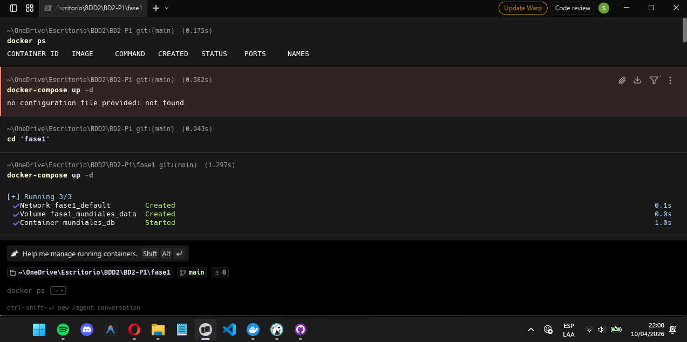
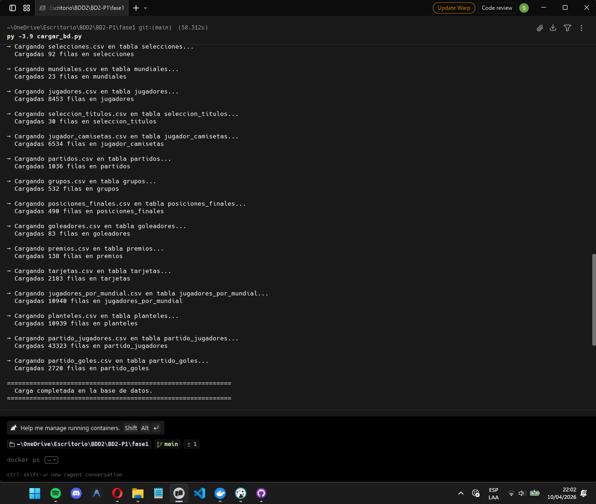
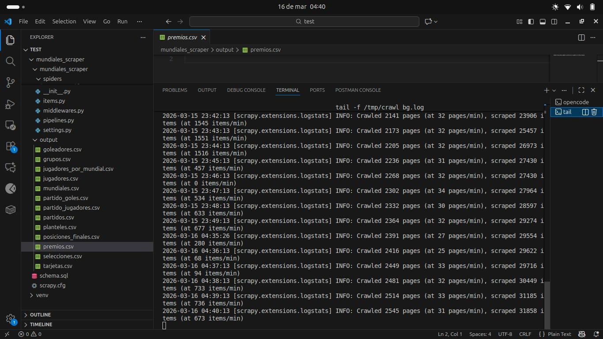
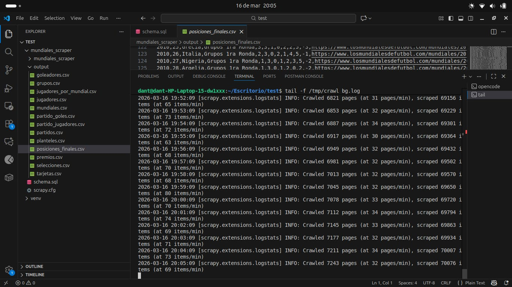
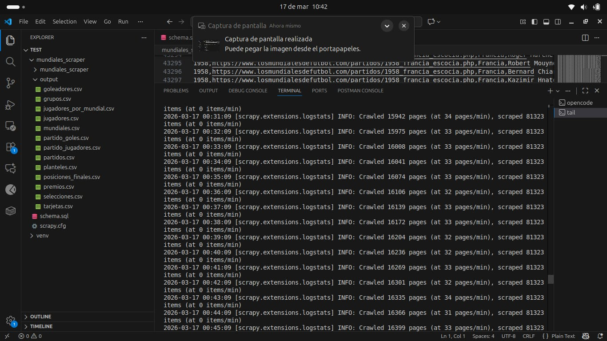

# Universidad de San Carlos de Guatemala

## Facultad de Ingenieria

### Escuela de Ciencias y Sistemas

---

## Sistemas de Bases de Datos 2

### Proyecto Fase 1 - Documentacion tecnica

**Seccion:** B  
**Grupo:** 17  

**Integrantes:**

- Engel Emilio Coc Raxjal - 202200314
- Harold Alejandro Sanchez Hernandez - 202200100
- Juan Esteban Chacon Trampe - 202300431

---


# Proyecto Fase 1

## 1. Indice

- 2. Flujo completo de datos
- 3. Estructura del repositorio
- 4. Capa 1: Scraping 
- 5. Capa 2: Transformacion
- 6. Capa 3: Base de datos en Docker
- 7. Modelo de datos 
- 8. Validaciones realizadas 
- 9. Stored Procedures
- 10. Guia de ejecucion
- 11. Archivos auxiliares y evidencias con fecha

## 2. Flujo completo de datos

Pipeline de punta a punta:

1. **Scraping** -> usa `scrapy.cfg` + paquete `mundiales_scraper/` y genera CSV crudos.
2. **Transformacion** -> `transformar_output.py` genera CSV limpios en `output_db/`.
3. **Infraestructura BD** -> `docker-compose.yml` levanta MySQL y ejecuta `init/schema.sql`.
4. **Carga** -> `cargar_bd.py` inserta `output_db/*.csv` en MySQL.
5. **Consulta** -> stored procedures (`stored/sp1.sql`, `stored/sp2.sql`) para explotacion.

Separacion:

- `output/`: datos raw oficiales usados por ETL (extraer, tranformar, cargar) siendo los que se usan en `transformar_output.py`
- `output_db/`: datos normalizados para la BD

## 3. Estructura del repositorio

Archivos y carpetas principales:

- `scrapy.cfg` -> configuracion principal de Scrapy.
- `mundiales_scraper/` -> paquete del scraper (settings, items, pipelines, spiders).
- `output/` -> CSV crudos del scraping.
- `output_db/` -> CSV normalizados.
- `transformar_output.py` -> ETL de crudo a normalizado.
- `cargar_bd.py` -> carga a MySQL desde `output_db`.
- `init/schema.sql` -> modelo SQL oficial.
- `docker-compose.yml` -> servicio MySQL.
- `stored/sp1.sql` -> procedimiento `sp_info_mundial`.
- `stored/sp2.sql` -> procedimiento `sp_info_pais`.
- `doc/storedProcedures.md` -> documentacion funcional de SP.
- `doc/scrapt_doc.md` -> documentacion detallada de scraping.
- `doc/TrasformacionCarga.md` -> documentacion detallada de ETL/carga.


## 4. Capa 1: Scraping (extraccion)

Implementacion actual del scraper:

- Config principal: `scrapy.cfg` (setting default `mundiales_scraper.settings`).
- Spider principal: `mundiales_scraper/spiders/mundiales.py` (name: `mundiales`).
- Componentes de soporte:
  - `mundiales_scraper/settings.py`
  - `mundiales_scraper/items.py`
  - `mundiales_scraper/pipelines.py`
  - `mundiales_scraper/middlewares.py`

Ejecucion tipica del scraping:

```bash
scrapy crawl mundiales
```

### 4.1 Alcance de la extraccion

Se extrae informacion historica de mundiales (torneos, selecciones, partidos, jugadores, premios, etc.) y se guarda en archivos CSV separados por entidad.

### 4.2 Herramientas y logica

En el proceso se uso un enfoque de crawler estructurado:

- Scrapy para navegacion y orquestacion de requests.
- BeautifulSoup para parseo flexible de HTML heterogeneo.
- Regex para clasificar URLs y extraer patrones.
- CSV por entidad para salida auditable.

Decisiones tecnicas importantes:

- Mantener `output/` como capa raw.
- No forzar normalizacion fuerte en scraping.
- Dejar limpieza y mapeo de IDs para ETL, es decir extraer, transformar y cargar `transformar_output.py`

### 4.3 Salida cruda producida (`output/`)

CSV principales:

- `mundiales.csv`
- `selecciones.csv`
- `jugadores.csv`
- `partidos.csv`
- `grupos.csv`
- `posiciones_finales.csv`
- `goleadores.csv`
- `premios.csv`
- `tarjetas.csv`
- `jugadores_por_mundial.csv`
- `planteles.csv`
- `partido_jugadores.csv`
- `partido_goles.csv`

### 4.4 Problemas esperables en raw

Los CSV crudos pueden incluir:

- URLs absolutas y relativas mezcladas.
- Fechas en formatos mixtos.
- Numeros con ruido textual.
- Campos vacios o pendientes (especialmente torneos futuros).
- Filas no totalmente alineadas al esquema final.

Esto es normal en scraping web y se corrige en la capa ETL.


## 5. Capa 2: Transformacion (`transformar_output.py`)

### 5.1 Proposito

Convertir `output/` (raw) a `output_db/` (normalizado), listo para carga SQL.

### 5.2 Funciones clave del ETL

El script:

1. Lee CSV de `output/`.
2. Construye mapas de IDs.
3. Aplica limpieza por tabla.
4. Genera CSV finales en `output_db/`.
5. Exporta mapas de referencia `_mapa_*.csv`.

### 5.3 Mapas de referencia

Mapeos construidos:

- `seleccion -> id_seleccion`
- `anio -> id_mundial`
- `url_jugador normalizada -> id_jugador`
- `url_partido normalizada -> id_partido`
- `nombre_jugador -> id_jugador` (fallback)

Archivos de salida:

- `output_db/_mapa_selecciones.csv`
- `output_db/_mapa_mundiales.csv`
- `output_db/_mapa_jugadores.csv`
- `output_db/_mapa_partidos.csv`

### 5.4 Limpiezas aplicadas

- IDs normalizados (`18.0` -> `18`).
- Fechas a formato SQL cuando aplica.
- Numericos extraidos de textos mixtos.
- Booleanos estandarizados.
- Altura a cm con soporte a formatos reales (`1.82 m / ...`).
- URLs de jugador/partido normalizadas por basename.
- Filas no insertables por integridad (ej. sin jugador requerido) filtradas en tablas puntuales.

### 5.5 Resultado

`output_db/` queda apto para carga relacional, con IDs coherentes y estructura alineada al schema.


## 6. Capa 3: Base de datos en Docker

### 6.1 Motor y despliegue

- MySQL 8.0 via Docker Compose.
- Inicializacion automatica desde `init/schema.sql`.

Comandos tipicos:

```bash
docker compose up -d
docker compose ps
```

Reinicio limpio (opcional):

```bash
docker compose down -v
docker compose up -d
```

### 6.2 Carga de datos

Script oficial:

- `cargar_bd.py`

Comando:

```bash
venv/bin/python cargar_bd.py
```

El script:

- conecta a MySQL,
- limpia tablas destino ,
- inserta en orden de dependencias FK,
- normaliza `NULL` y formatos al insertar.


## 7. Modelo de datos (normalizado)

Schema oficial:

- `init/schema.sql`

Principios de modelado aplicados:

- PK con IDs (`id_*`) en lugar de URL como clave primaria.
- FK entre tablas de dominio para integridad referencial.
- Tablas separadas para evitar multivaluados (1FN) y redundancia.
- Tipos apropiados para analitica SQL (`DATE`, enteros, decimales, booleanos).

Tablas principales:

- `selecciones`, `mundiales`, `jugadores`, `partidos`
- `grupos`, `posiciones_finales`, `goleadores`, `premios`, `tarjetas`
- `jugadores_por_mundial`, `planteles`, `partido_jugadores`, `partido_goles`
- `seleccion_titulos`, `jugador_camisetas`
- `scraping_runs`, `scraping_metadata`


## 8. Validaciones realizadas

Estado validado despues de transformar y cargar:

- Carga completada sin errores en tablas core.
- FK criticas nulas: `0`.
- Huerfanos en joins criticos: `0`.
- Conteos coherentes en tablas principales (selecciones, mundiales, jugadores, partidos, detalle de partido).

Observaciones:

- Algunos campos opcionales vacios por fuente original algo que se tenia esperado
- Casos de 2026 con informacion incompleta se mantienen como `NULL`.


## 9. Stored Procedures

### 9.1 Archivos

- `stored/sp1.sql` -> `sp_info_mundial`
- `stored/sp2.sql` -> `sp_info_pais`

### 9.2 Objetivo de cada SP

- `sp_info_mundial`: vista integral por año de mundial (ficha, grupos, partidos, posiciones, goleadores, premios, disciplina).
- `sp_info_pais`: historial completo por seleccion (participaciones, sedes, partidos, logros, disciplina, resumen por mundial).

### 9.3 Parametros

`sp_info_mundial`:

- `p_anio` (requerido)
- `p_grupo` (opcional)
- `p_seleccion` (opcional)
- `p_fecha` (opcional)

`sp_info_pais`:

- `p_seleccion` (requerido)
- `p_anio` (opcional)
- `p_solo_fase` (opcional)

### 9.4  Carga de SP

Comandos:

```bash
docker exec -i mundiales_db mysql --default-character-set=utf8mb4 -u mundiales_user -pmundiales1234 mundiales < stored/sp1.sql
docker exec -i mundiales_db mysql --default-character-set=utf8mb4 -u mundiales_user -pmundiales1234 mundiales < stored/sp2.sql
```

Ejemplo:

```bash
docker exec mundiales_db mysql --default-character-set=utf8mb4 -u mundiales_user -pmundiales1234 -D mundiales -e "CALL sp_info_pais('Mexico', 2022, NULL);"
```


## 10. Guia de ejecucion rapida 

Orden recomendado:

1. Levantar MySQL:

```bash
docker compose up -d
```

2. Transformar CSV:

```bash
venv/bin/python transformar_output.py
```

3. Cargar BD:

```bash
venv/bin/python cargar_bd.py
```

4. Cargar SP:

```bash
docker exec -i mundiales_db mysql --default-character-set=utf8mb4 -u mundiales_user -pmundiales1234 mundiales < stored/sp1.sql
docker exec -i mundiales_db mysql --default-character-set=utf8mb4 -u mundiales_user -pmundiales1234 mundiales < stored/sp2.sql
```


## 11. Archivos temporales o auxiliares para carga y documentacion con screenshots

### 11.1 Archivos temporales o auxiliares utilizados para la carga de datos

Durante la fase  se generan archivos auxiliares en `output_db/` que sirven para mantener la trazabilidad de IDs y asegurar la integridad referencial durante la carga con `cargar_bd.py`.

Archivos auxiliares principales:

- `output_db/_mapa_selecciones.csv`: mapa `seleccion -> id_seleccion`.
- `output_db/_mapa_mundiales.csv`: mapa `anio -> id_mundial`.
- `output_db/_mapa_jugadores.csv`: mapa `url_jugador_normalizada -> id_jugador`.
- `output_db/_mapa_partidos.csv`: mapa `url_partido_normalizada -> id_partido`.

Estos archivos son consumidos por `transformar_output.py` para generar los CSV finales normalizados y permiten que `cargar_bd.py` inserte datos en el orden correcto de dependencias FK.

### 11.2 Evidencias (screenshots) con fecha

Las siguientes capturas documentan ejecucion de scraping, levantado de contenedor y carga de datos. La fecha/hora corresponde al timestamp del archivo en el repositorio local.

1. Docker levantado (`docker compose up -d`)  
  **Fecha:** 10-04-2026
  

2. Carga de datos (`cargar_bd.py`)  
  **Fecha:** 10-04-2026  
  

3. Evidencia de scraping 1  
  **Fecha:** 15-03-2026 
  

4. Evidencia de scraping 2  
  **Fecha:** 16-03-2026  
  

5. Evidencia de scraping 3  
  **Fecha:** 17-03-2026 
  
